# FCP Transition Gallery

All **65** built-in Final Cut Pro transitions rendered headlessly through the real Motion engine.
Each one transitions between two sample photos.

## 360° (8)

| | | |
|---|---|---|
| **360° Bloom**  | **360° Circle Wipe**  | **360° Divide**  |
| **360° Gaussian Blur**  | **360° Push**  | **360° Reveal Wipe**  |
| **360° Slide**  | **360° Wipe**  |  |

## Blurs (4)

| | | |
|---|---|---|
| **Directional**  | **Gaussian**  | **Radial**  |
| **Zoom**  |  |  |

## Dissolves (1)

| | | |
|---|---|---|
| **Divide** 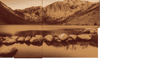 |  |  |

## Lights (5)

| | | |
|---|---|---|
| **Bloom**  | **Flash** 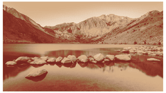 | **Lens Flare** 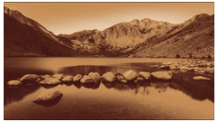 |
| **Light Noise** 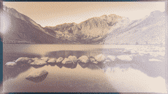 | **Static** 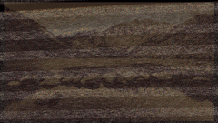 |  |

## Movements (17)

| | | |
|---|---|---|
| **Black Hole**  | **Clothesline** 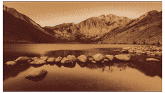 | **Color Planes**  |
| **Drop In** 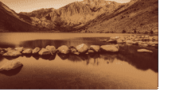 | **Earthquake**  | **Fall** 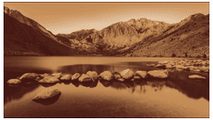 |
| **Flashback**  | **Flip**  | **Multi-flip** 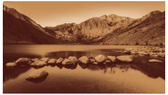 |
| **Pinwheel**  | **Push**  | **Reflection**  |
| **Rotate**  | **Scale**  | **Smear**  |
| **Swing**  | **Switch** 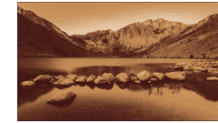 |  |

## Objects (5)

| | | |
|---|---|---|
| **Arrows**  | **Curtains** 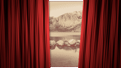 | **Leaves**  |
| **Squares**  | **Veil** 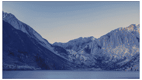 |  |

## Replicator:Clones (8)

| | | |
|---|---|---|
| **3D Rectangle**  | **Clone Spin** 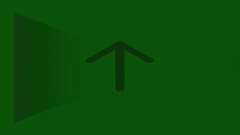 | **Combo Spin** 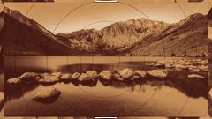 |
| **Concentric**  | **Duplicate**  | **Multi**  |
| **Vertigo**  | **Video Wall**  |  |

## Stylized (15)

| | | |
|---|---|---|
| **Center** 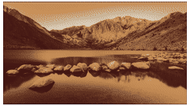 | **Center Reveal**  | **Close and Open** 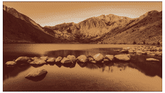 |
| **Color Panels**  | **Diagonal**  | **Glide**  |
| **Heart**  | **Light Sweep** 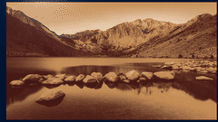 | **Loop** 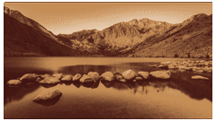 |
| **Lower**  | **Panels Across**  | **Panels Random**  |
| **Slide**  | **Slide In**  | **Up-Over** 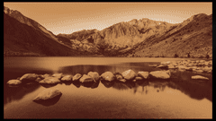 |

## Wipes (2)

| | | |
|---|---|---|
| **Diagonal** 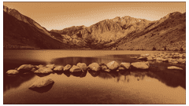 | **Mask**  |  |

